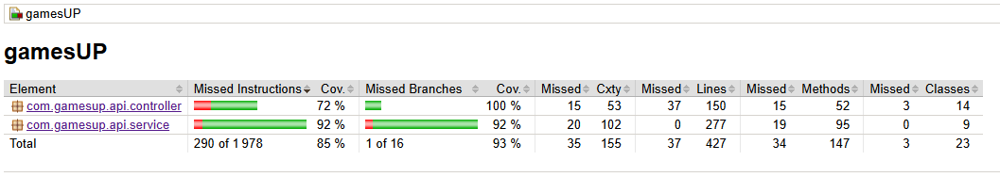

# GamesUP - Backend API

GamesUP est une plateforme de vente de jeux de société en ligne.

Ce backend développé avec **Spring Boot 3.3** et **Java 21** permet de gérer :
- le catalogue de jeux
- les utilisateurs
- les commandes
- les avis utilisateurs (reviews)
- les recommandations via une API Python (KNN)

---

## Prérequis

- [Git](https://git-scm.com/)
- [Java 21](https://www.oracle.com/java/)
- [Maven 4+](https://maven.apache.org/)
- [Docker](https://www.docker.com/)
- [Docker Compose](https://docs.docker.com/compose/)

---

## Installation

```bash
# 1. Cloner le dépôt
git clone https://github.com/ReVolTPFE/iscod-b4-edc-games-up.git
cd iscod-b4-edc-games-up

# 2. Démarrer l'application (BDD, Python ML API, Spring Boot)
docker compose up -d
```

L’application sera disponible sur :
- `http://localhost:8080` : API Spring Boot  
- `http://localhost:5000` : API Python de recommandations ML
- `http://localhost:8000` : Interface phpMyAdmin (optionnel, pour gérer la BDD)

---

## Authentification

Deux rôles sont définis :
- `CLIENT`
- `ADMIN`

La sécurité repose sur Spring Security avec un système JWT.

---

## Principaux Endpoints REST

Voir `docs/api-endpoints.md` pour la liste complète des endpoints.

---

## Tests et couverture de code

```bash
mvn clean verify

# Ficher de rapport HTML
target/site/jacoco/index.html
```

### Couverture de code mesurée (API Python non incluse) :



---

## Bonnes pratiques respectées

- ✅ Architecture REST propre et modulaire
- ✅ Respect des principes **SOLID**
- ✅ Utilisation de DTOs pour exposer les données
- ✅ Sécurité centralisée avec Spring Security
- ✅ Couverture de tests avec JaCoCo
- ✅ Intégration de l’IA via API externe

---

## Diagrammes du projet

Voir `docs/diagrams` pour les différents diagrammes UML. Ils sont disponibles au format Mermaid UML via fichiers markdown ou en PNG directement.

## Explications du projet (bonnes/mauvaises pratiques, cheminement de création, API Python ML)

Voir `docs/explications-travail-projet.md` pour les explications détaillées sur le respect des bonnes pratiques, le cheminement de création du projet et l'implémentation de l'API Python de recommandations ML.

## Collection Postman

Voir `docs/EDC-B4.postman_collection.json` pour la collection Postman contenant tous les endpoints des APIs Spring et Python.
