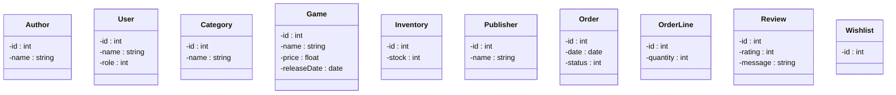

```mermaid
classDiagram
  class Author {
    -id : int
    -name : string
  }

  class User {
    -id : int
    -name : string
    -role : int
  }

  class Category {
    -id : int
    -name : string
  }

  class Game {
    -id : int
    -name : string
    -price : float
    -releaseDate : date
  }

  class Inventory {
    -id : int
    -stock : int
  }

  class Publisher {
    -id : int
    -name : string
  }

  class Order {
    -id : int
    -date : date
    -status : int
  }

  class OrderLine {
    -id : int
    -quantity : int
  }

  class Review {
    -id : int
    -rating : int
    -message : string
  }

  class Wishlist {
    -id : int
  }

```